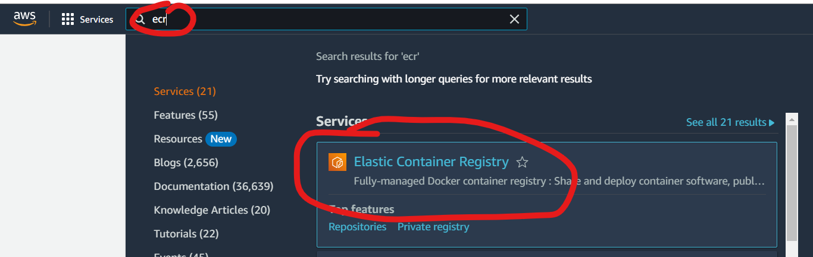
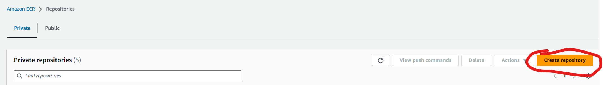
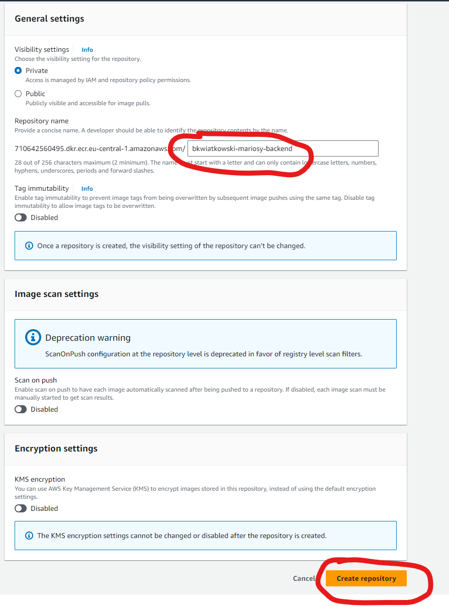
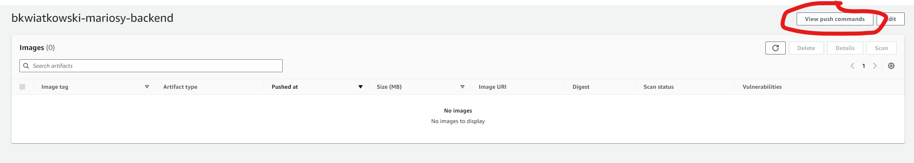
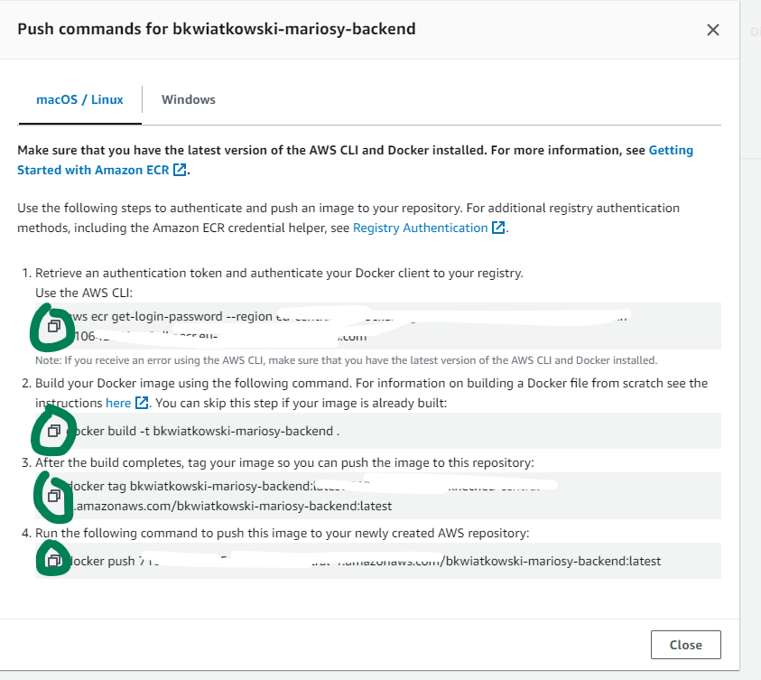
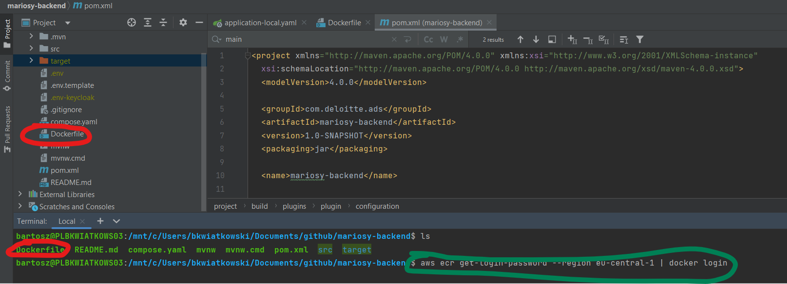
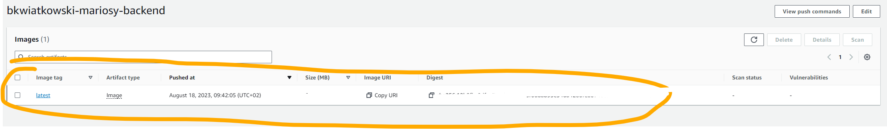

# 🐳 AWS ECR

## 📦 Create Repository

## 🚀 Push Image to ECR
### 📝 Check the commands

### 📋 Copy and enter this 4 commands into terminal at **our project directory**

⚠️Double check you have Dockerfile and the path location ⚠️

### ✅ Check the image successfully pushed to ECR
