# 🚢 AWS ECS

## 🛠️ Create ECS Cluster
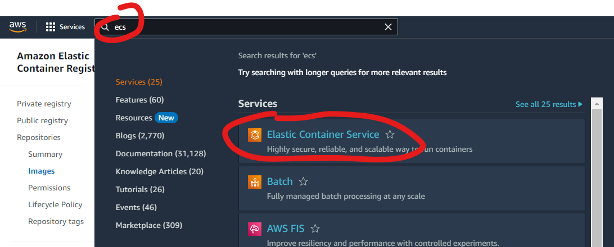
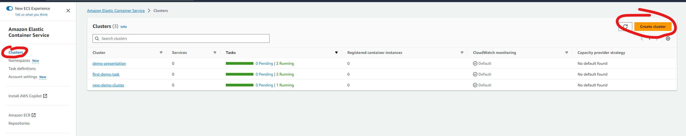
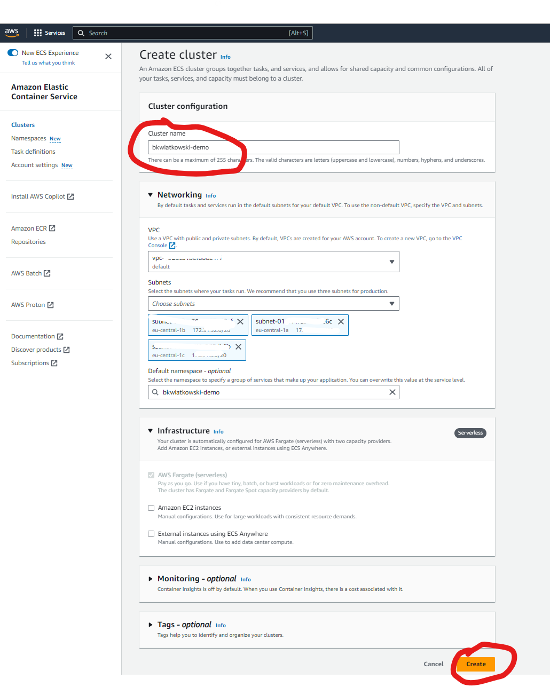

## 📄 Create Task definition
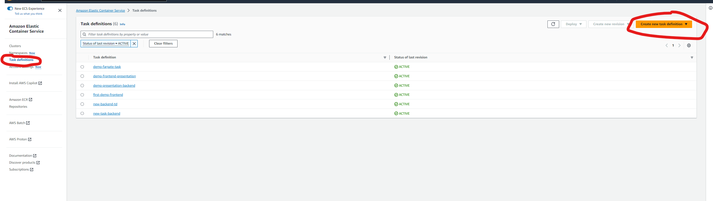

### 🖥️ Specify task operating system and setup roles
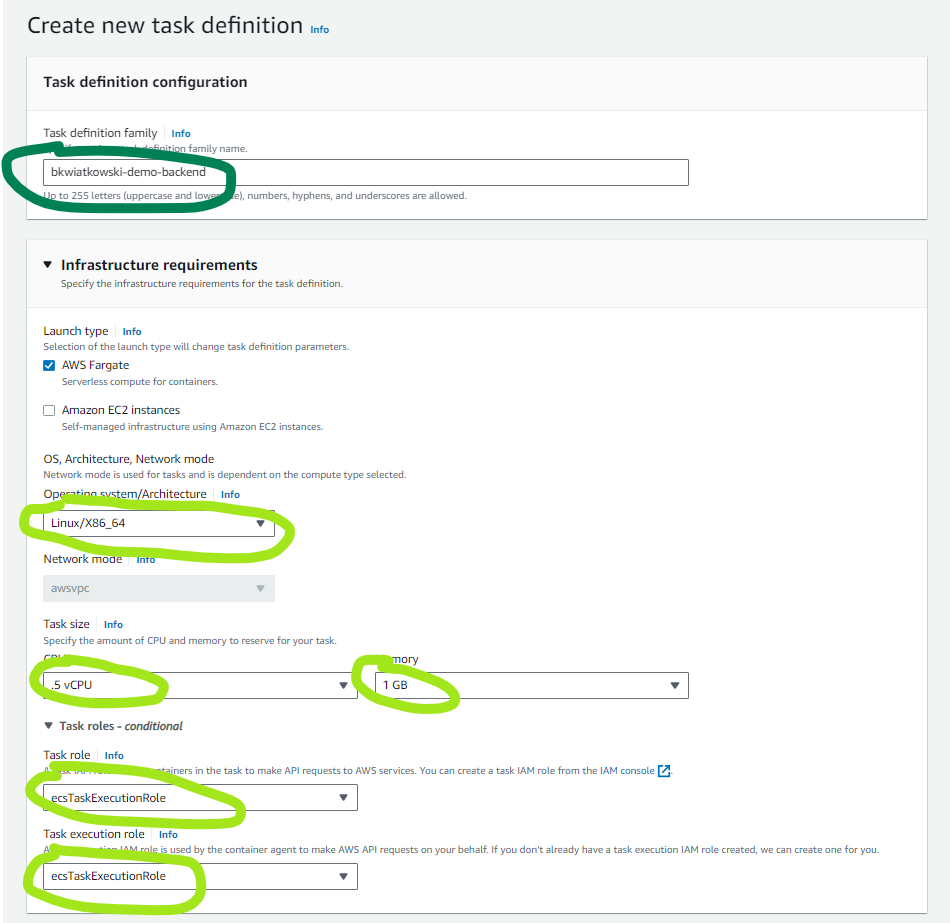
⚠️ Copy URI (Gold color) from AWS ECR to AWS ECS⚠️
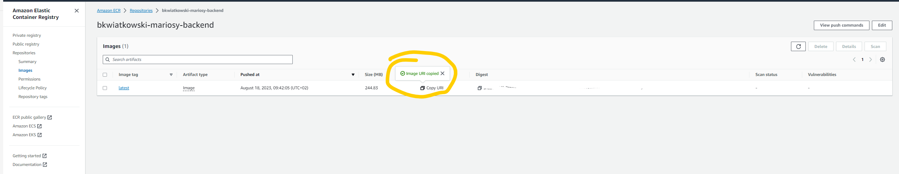
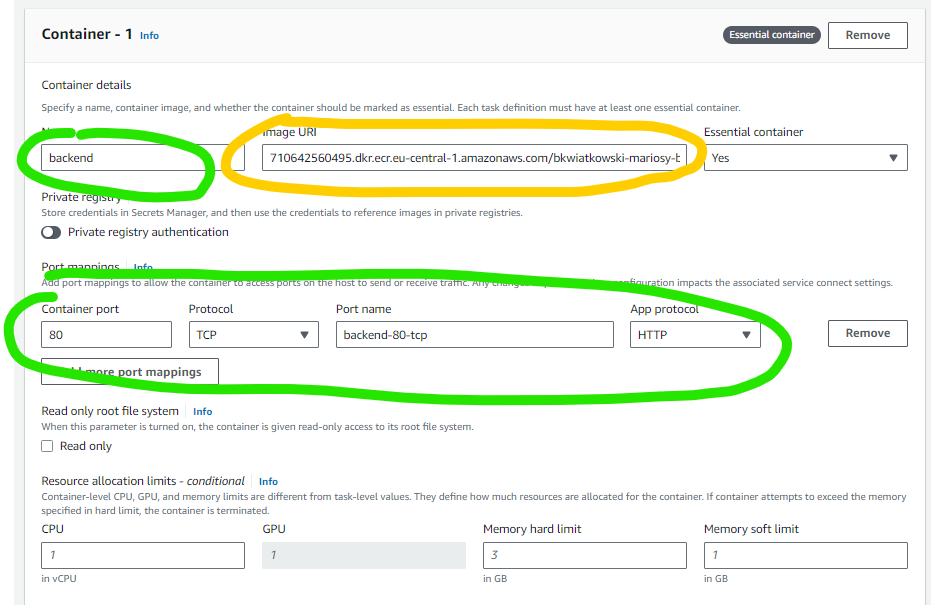
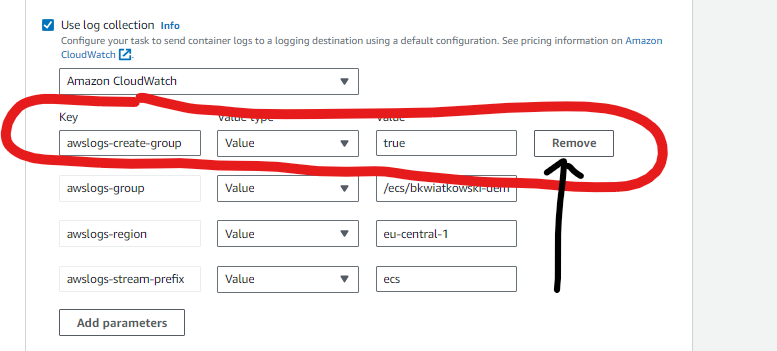

## 🏃‍♂️ Run task in cluster
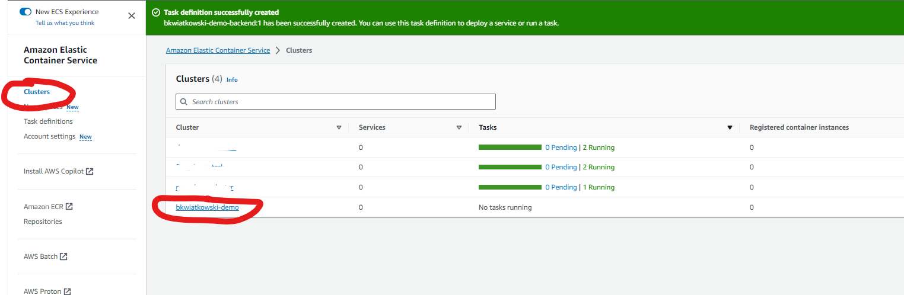
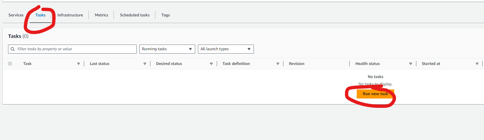
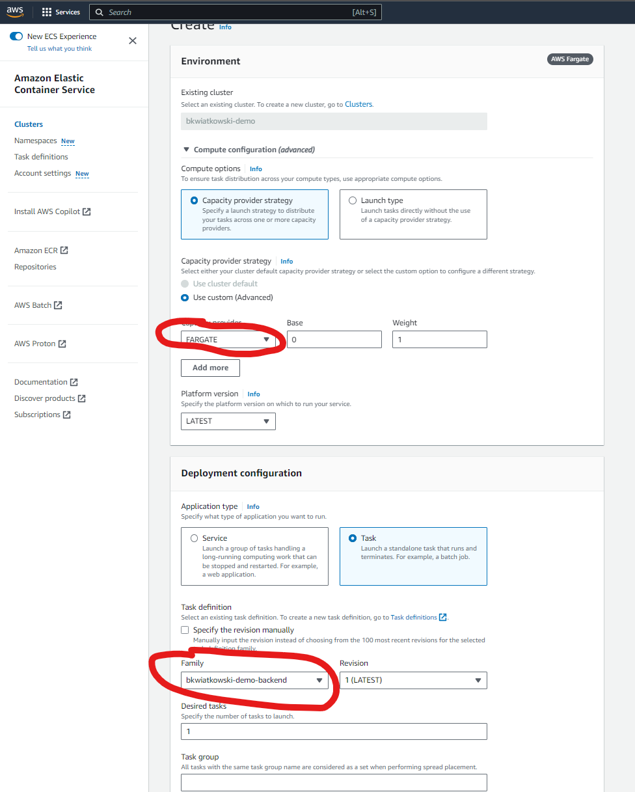
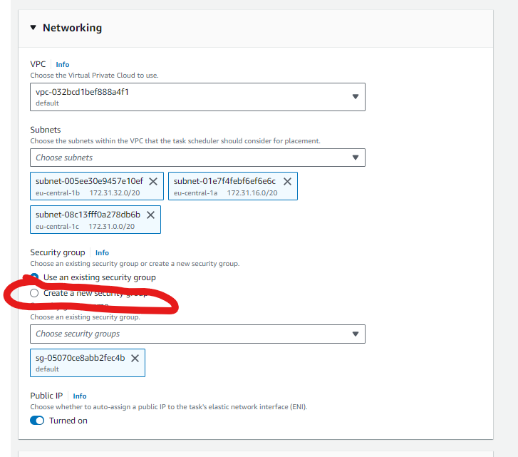
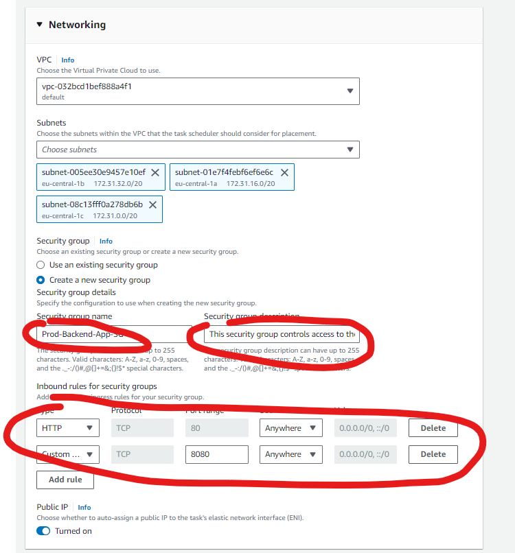

## ✅ Check app working

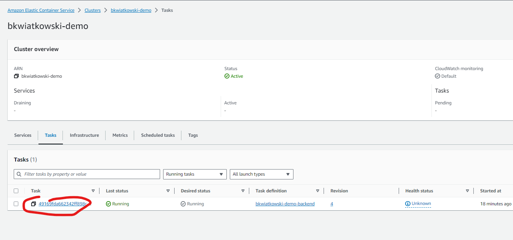
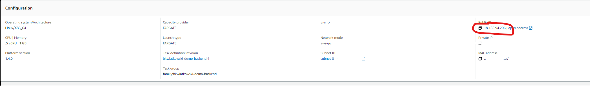

Now go to this ip adress and checkout your application.

