# 🛢️ AWS S3 - Angular Deploy

## 📁 Creating S3 Bucket

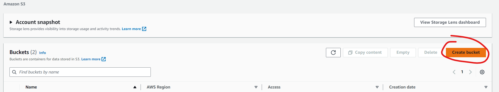

⚠️ Disable Bocking Public Access ⚠️

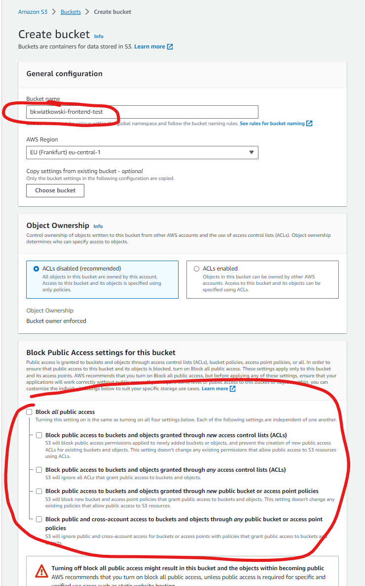

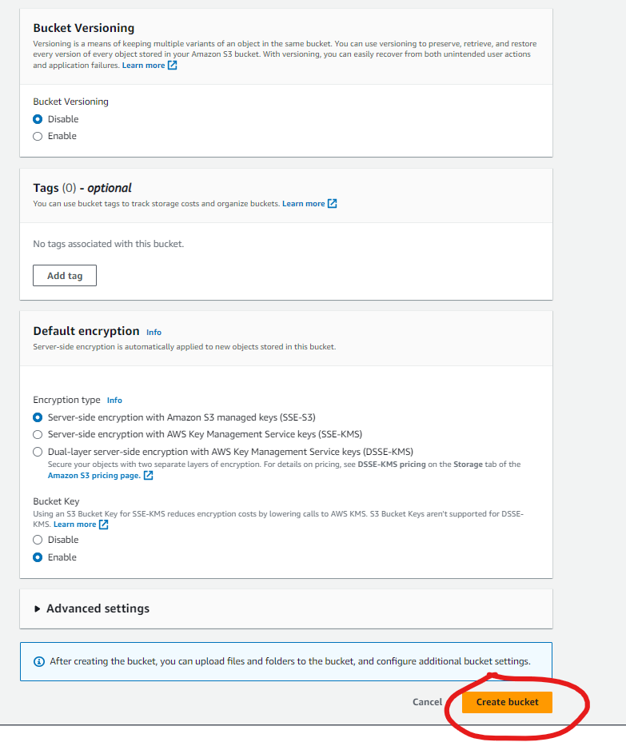

## 🌐 Enabling S3 Static Website Hosting
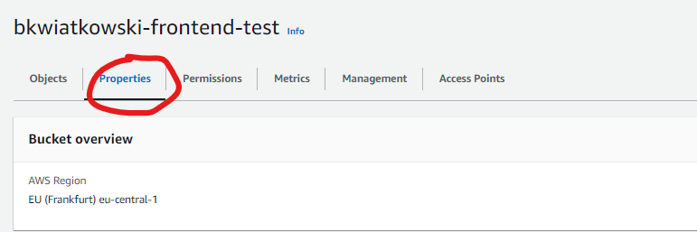
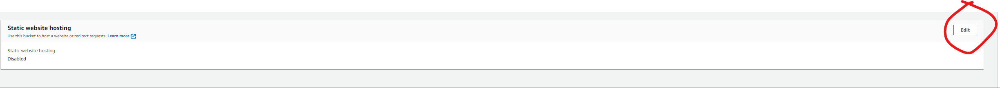
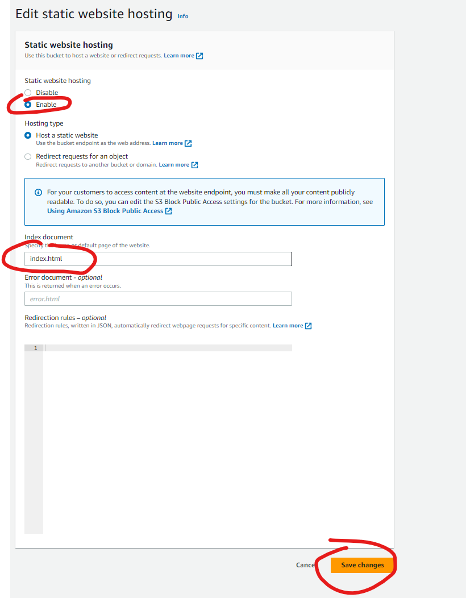

## 🔒 Adding policies
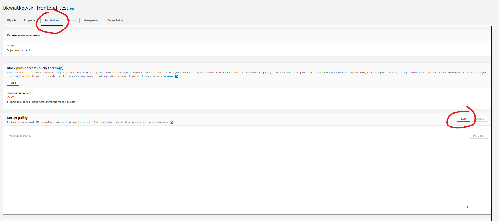
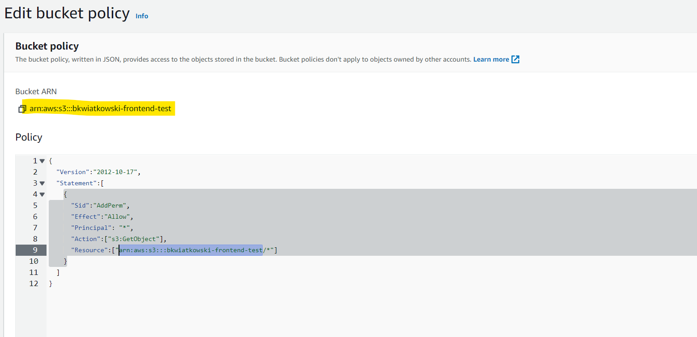


## 🛠️ Build angular project
```bash
ng build
```

And we can find directory `dist` in main project folder.

## ⬆️ Uploading Angular Frontend
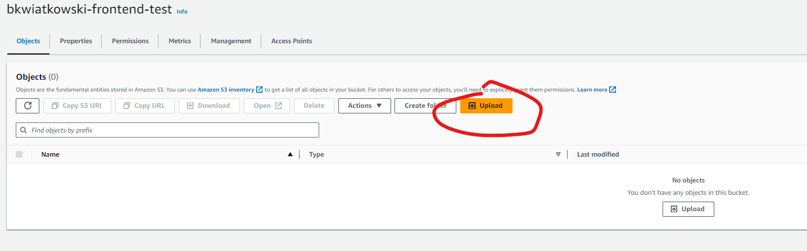
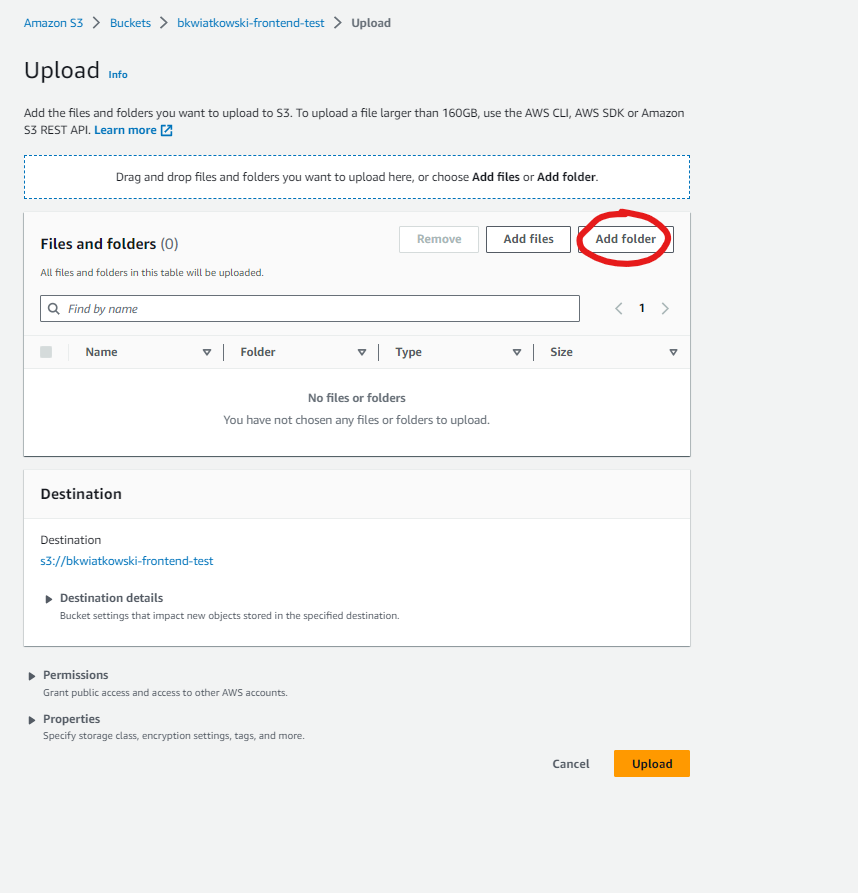
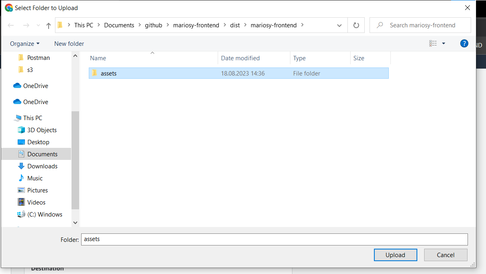
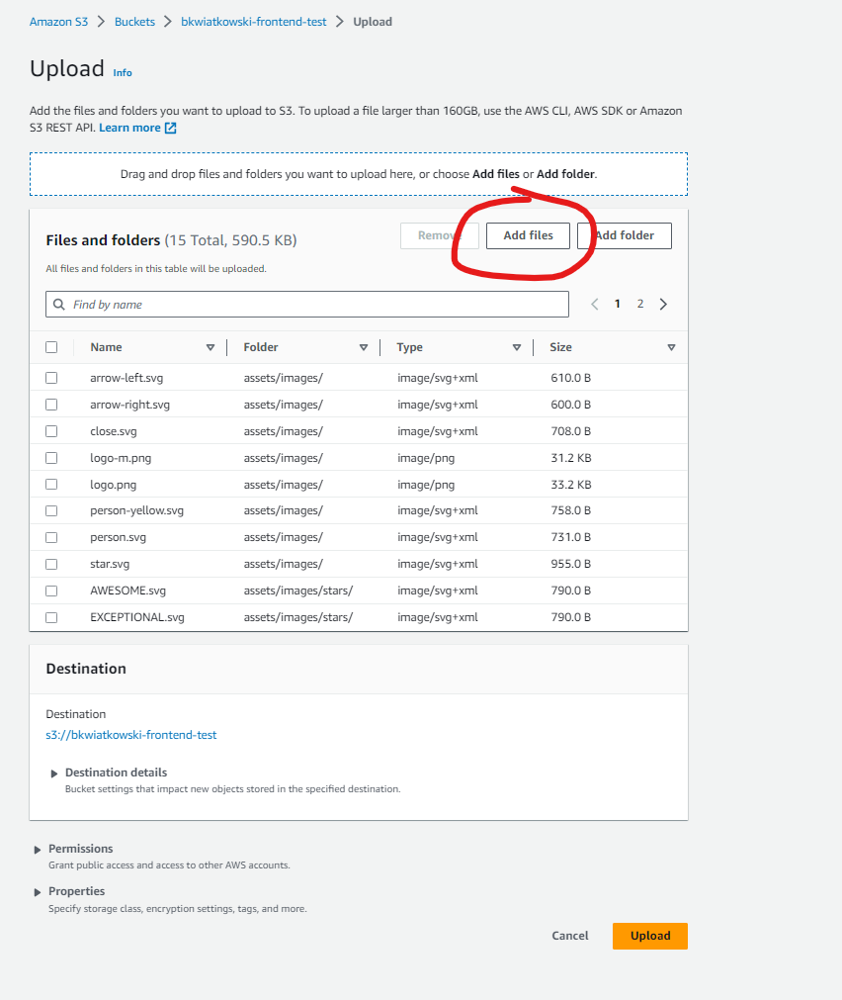
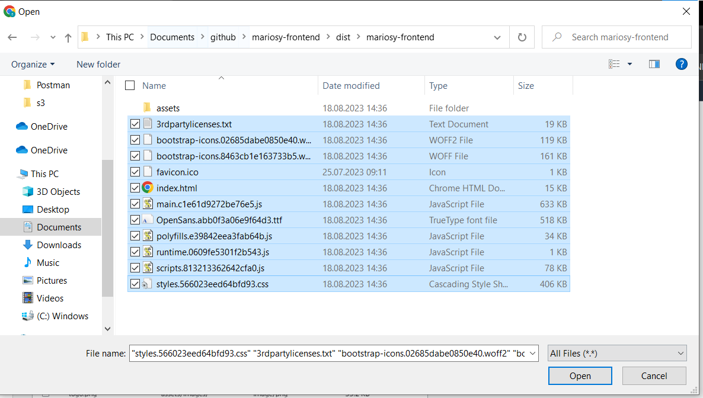

## ✅ Checking website working at AWS S3
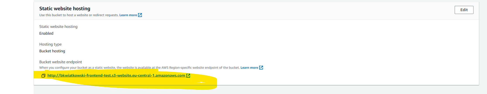