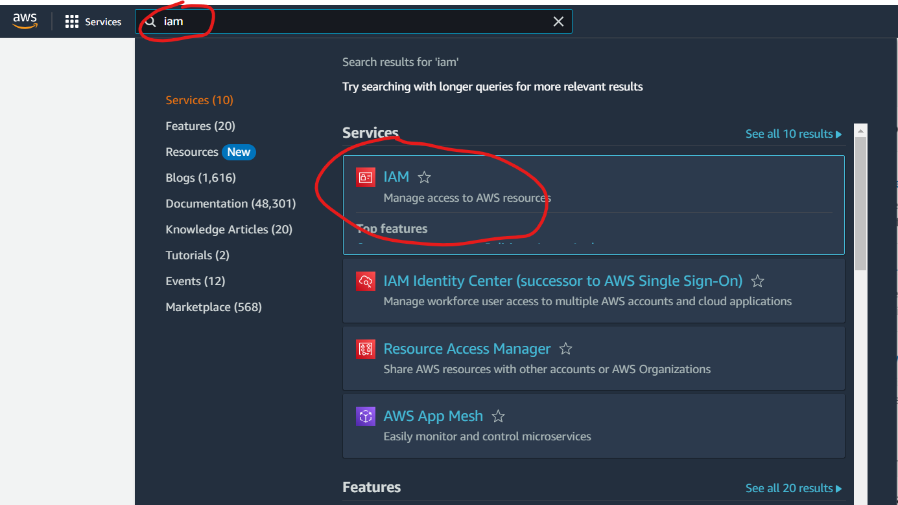
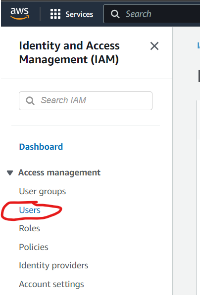
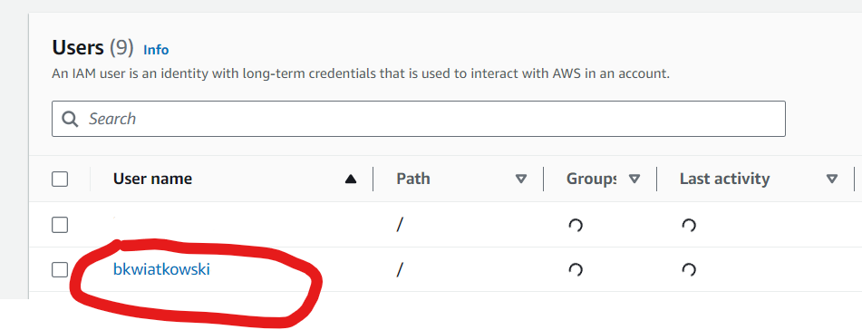
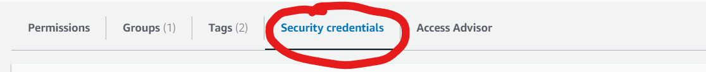
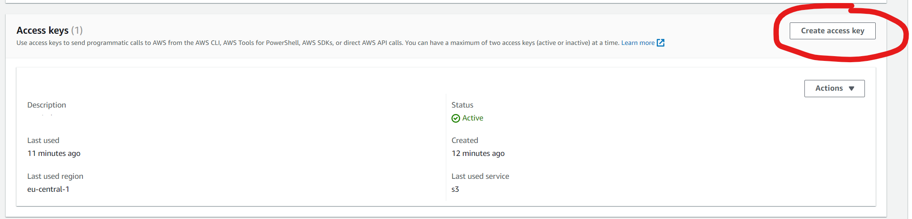
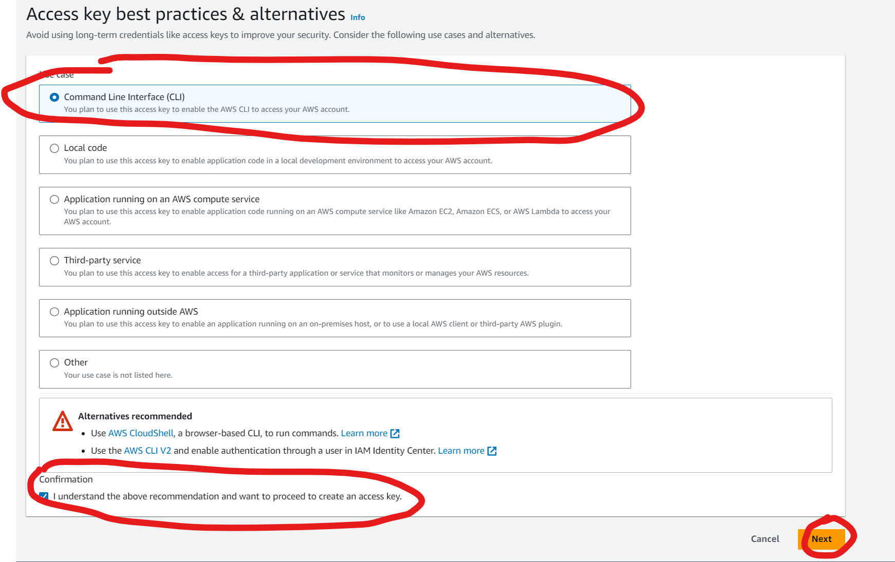
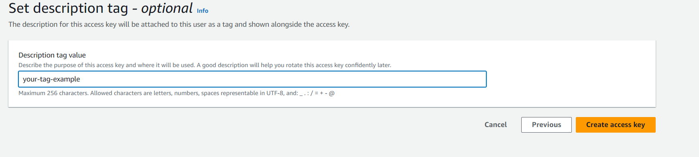
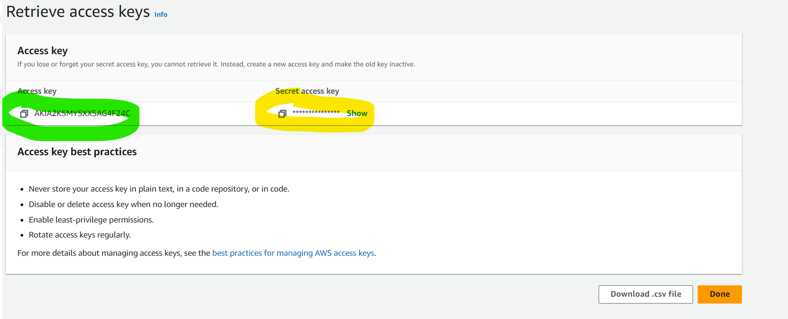
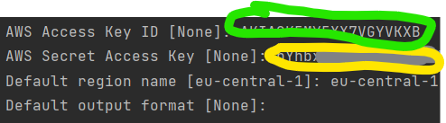

# ⚙️ Configure AWS CLI

## Installation
### ⬇️ Install AWS CLI (Ubuntu / WSL)
```bash
sudo apt-get update
sudo apt-get install awscli
```

### ✅ Check installation complete
```bash
aws --version

# Output should be like that
aws-cli/1.29.28 Python/3.10.12 Linux/5.15.90.1-microsoft-standard-WSL2 botocore/1.31.28
```

## 🛠️ Credentials
### Generate credentials








### 🚀 Enter credentials to terminal

```bash
aws configure
```
enter credentials from AWS Console:


### 🔄 Check AWS CLI working

```bash
aws s3 ls

# Example output
2023-08-17 09:13:52 first-demo-1
```